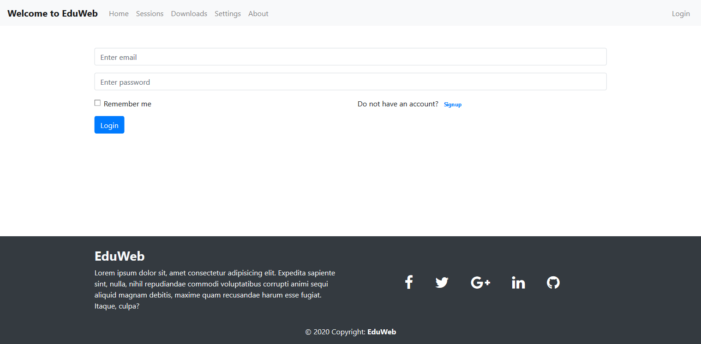
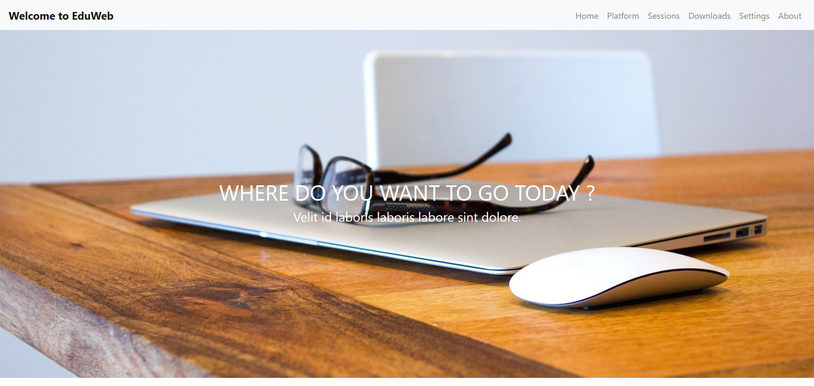
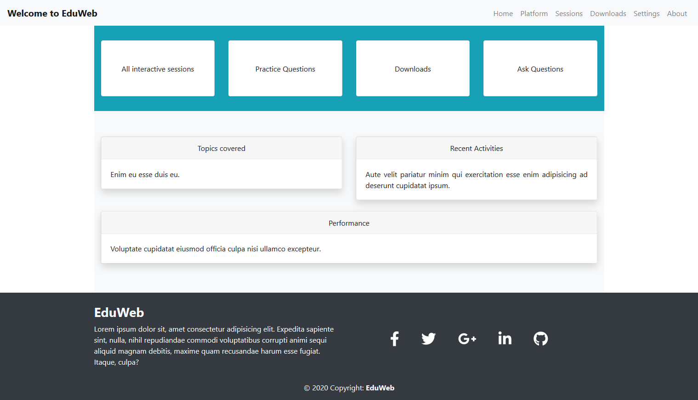
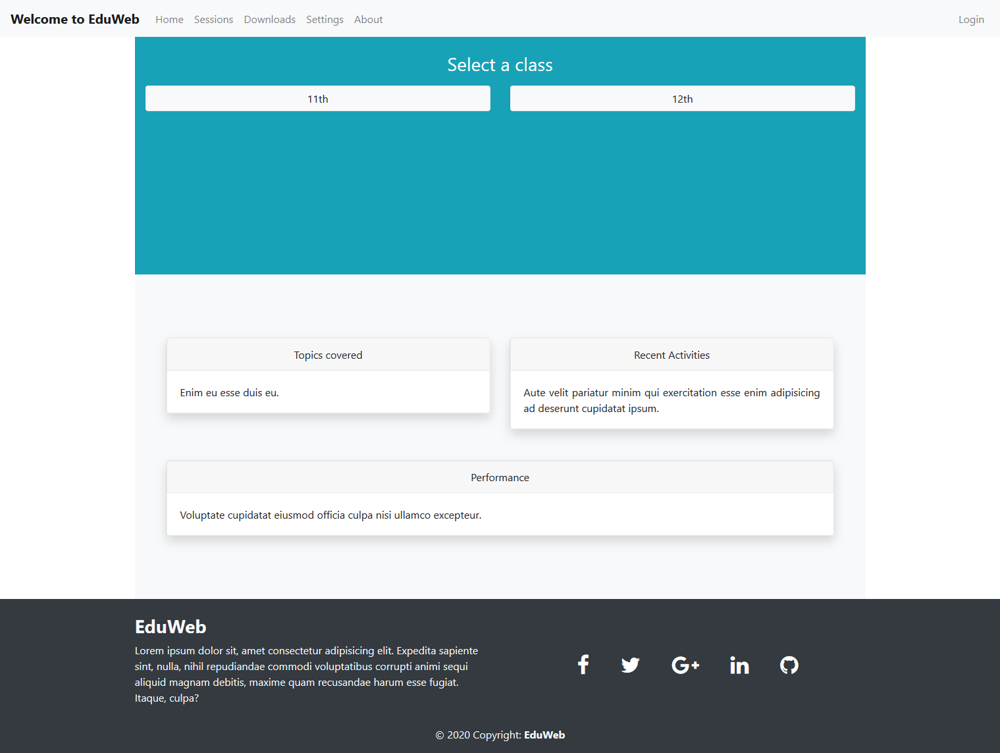

<h1 align="center"></h1>

An online website template which login the user and then shows the various courses provided to the user to select and then pursue the same.

[](https://app.netlify.com/sites/eduw/deploys)

View Live -- [EduWeb](https://eduw.netlify.app/)

## Getting Started 🚀

These instructions will get you a copy of the project up and running on your local machine for development and testing purposes.

You'll need [Git](https://git-scm.com) and [Node.js](https://nodejs.org/en/download/) (which comes with [npm](http://npmjs.com)) installed on your computer.

```
node@v10.16.0 or higher
npm@6.9.0 or higher
git@2.17.1 or higher
```

## How To Use 🔧

From your command line, clone and run EduWeb:

```bash
# Clone this repository
$ git clone https://github.com/PulkitBanta/EduWeb.git

# Go into the repository
$ cd EduWeb

# Install dependencies
$ npm install

#Start's development server
$ npm start
```

## ScreenShots








## Features

- Material design
- Client side state management
- Responsive design
- Login and Signup feature
- More Access to logged in users

## Built With

- [Angular](https://angular.io/) - One framework. Mobile & desktop.
- [Bootstrap 4](https://getbootstrap.com/docs/4.0/getting-started/introduction/) - A modern responsive front-end framework.

## Contributing

Currently not accepting any contributions.

## Contributors

| [](https://github.com/PulkitBanta) |
| --- |
| [Pulkit Banta](https://github.com/PulkitBanta) |
| <p align="center"><a title="code">💻</a> <a title="designing">🎨</a> <a title="documentation">📖</a></p>

## License

This project is licensed under the MIT License - see the [LICENSE](LICENSE) file for details